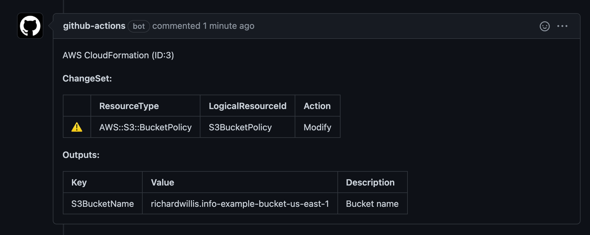
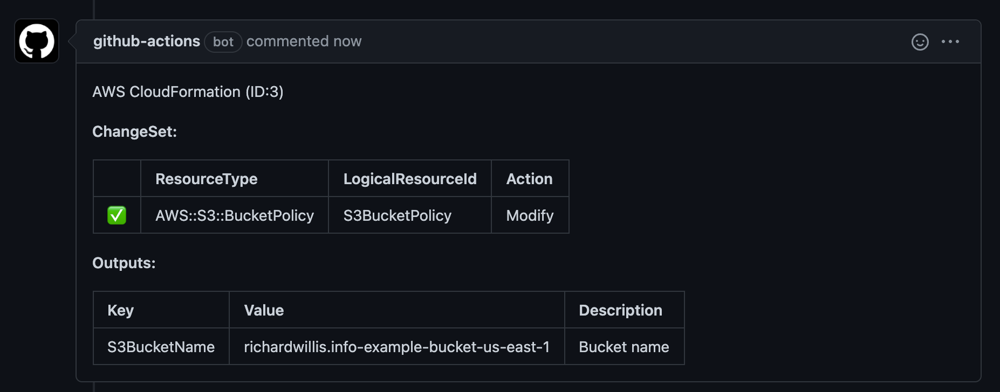
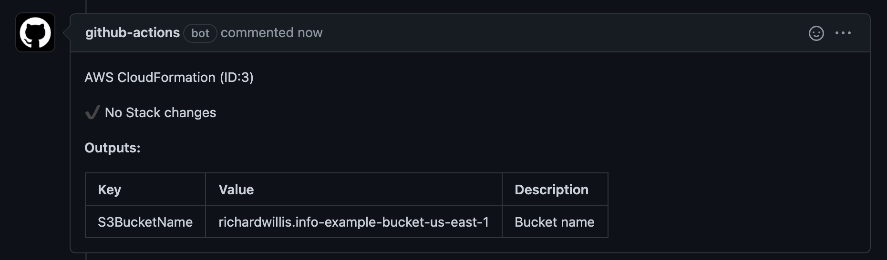

# AWS CloudFormation GitHub Action

[](https://github.com/badsyntax/github-action-aws-cloudformation/actions/workflows/test.yml)
[](https://github.com/badsyntax/github-action-aws-cloudformation/actions/workflows/deploy-stack.yml)
[](https://github.com/badsyntax/github-action-aws-cloudformation/actions/workflows/codeql-analysis.yml)

A GitHub Action to create/update your CloudFormation stack to support Infrastructure as Code.

## Motivation

The [official CloudFormation action](https://github.com/aws-actions/aws-cloudformation-github-deploy) is archived with no explanation why.

This Action is actively maintained and includes additional features.

## Features

- Apply or Preview ChangeSet with Pull Request comments
- Log intervals to show constant feedback
- CloudFormation outputs set as Action Outputs (which can be used in subsequent steps)

## Getting Started

Please read <https://github.com/aws-actions/aws-cloudformation-github-deploy#credentials-and-region>

```yaml
name: 'deploy'

concurrency:
  group: prod_deploy
  cancel-in-progress: false

on:
  repository_dispatch:
  pull_request:
  push:
    branches:
      - main
      - 'releases/*'

jobs:
  deploy-stack:
    runs-on: ubuntu-latest
    steps:
      - uses: actions/checkout@v2

      - name: Configure AWS Credentials
        uses: aws-actions/configure-aws-credentials@v1
        with:
          aws-access-key-id: ${{ secrets.AWS_ACCESS_KEY_ID }}
          aws-secret-access-key: ${{ secrets.AWS_SECRET_ACCESS_KEY }}
          aws-region: us-east-1

      - name: Update CloudFormation Stack
        id: update-stack
        uses: badsyntax/github-action-aws-cloudformation@master
        if:
        with:
          stack-name: 'example-cloudformation-stack'
          template: './cloudformation/s3bucket-example.yml'
          # Only apply the changeset on pushes to main/release
          apply-change-set: ${{ github.event_name != 'pull_request' && github.event_name != 'repository_dispatch' }}
          aws-region: 'us-east-1'
          parameters: 'S3BucketName=example-bucket-us-east-1&S3AllowedOrigins=https://example.com'

      - name: Deploy Website
        run: |
          # Now that the stack is created we can deploy our
          # website to the S3 bucket.
          echo "Deploy to S3 Bucket: $S3BucketName"
        env:
          # Use outputs from the CloudFormation Stack
          S3BucketName: ${{ steps.update-stack.outputs.S3BucketName }}
```

## Action Inputs

| key                | description                                                                                         | example                                         |
| ------------------ | --------------------------------------------------------------------------------------------------- | ----------------------------------------------- |
| `stack-name`       | The name of the Cloudformation stack to be created                                                  | `example-com-static-cloudformation-stack`       |
| `template`         | The relative path to the CloudFormation stack template                                              | `./cloudformation/s3bucket_with_cloudfront.yml` |
| `aws-region`       | The AWS region in which to create the stack                                                         | `us-east-1`                                     |
| `parameters`       | The parameters to override in the stack inputs, in query string format. Whitespace will be stripped | `Param1=foo&Param2=http://example.com`          |
| `apply-change-set` | Whether to apply the ChangeSet, or provide a summary of the ChangeSet                               | `true`                                          |

## Action Outputs

| Name              | Description                                                                                                                                             | Example                                                                                  |
| ----------------- | ------------------------------------------------------------------------------------------------------------------------------------------------------- | ---------------------------------------------------------------------------------------- |
| `[cf-output-key]` | Outputs correspond to the CloudFormation outputs. For example if you've set an output to be `S3BucketName` then this key will exist as an Action output | `anything, depending on the CF output definition`                                        |
| `outputs`         | JSON string array of CloudFormation outputs                                                                                                             | `[{"OutputKey":"S3BucketName","OutputValue":"bucket-name","Description":"Bucket name"}]` |
| `changes`         | JSON string array of CloudFormation changes                                                                                                             | `[{"OutputKey":"S3BucketName","OutputValue":"bucket-name","Description":"Bucket name"}]` |

## Pull Request Comments

First you need to define the comment template. Download [pr-comment-template.hbs](https://github.com/badsyntax/github-action-aws-cloudformation/blob/master/.github/pr-comment-template.hbs) to your repo and update as appropriate.

Next add the [badsyntax/github-action-issue-comment](https://github.com/badsyntax/github-action-issue-comment) action to create Pull Request comments with an overview of the CloudFormation changes and outputs.

```yaml
name: 'deploy'

concurrency:
  group: prod_deploy
  cancel-in-progress: false

on:
  repository_dispatch:
  pull_request:
  push:
    branches:
      - main
      - 'releases/*'

jobs:
  deploy-stack:
    runs-on: ubuntu-latest
    steps:
      - uses: actions/checkout@v2

      - name: Configure AWS Credentials
        uses: aws-actions/configure-aws-credentials@v1
        with:
          aws-access-key-id: ${{ secrets.AWS_ACCESS_KEY_ID }}
          aws-secret-access-key: ${{ secrets.AWS_SECRET_ACCESS_KEY }}
          aws-region: us-east-1

      - name: Update CloudFormation Stack
        id: update-stack
        uses: badsyntax/github-action-aws-cloudformation@master
        if:
        with:
          stack-name: 'example-cloudformation-stack'
          template: './cloudformation/s3bucket-example.yml'
          # Only apply the changeset on pushes to main/release
          apply-change-set: ${{ github.event_name != 'pull_request' && github.event_name != 'repository_dispatch' }}
          aws-region: 'us-east-1'
          parameters: 'S3BucketName=example-bucket-us-east-1&S3AllowedOrigins=https://example.com'

      - uses: badsyntax/github-action-issue-comment@master
        name: Comment on Pull Request
        if: github.event_name == 'pull_request'
        with:
          action: 'create-clean'
          template: '.github/pr-comment-template.hbs'
          id: cloudformation
          token: ${{ secrets.GITHUB_TOKEN }}
          issue-number: ${{ github.event.pull_request.number }}
          template-inputs: |
            {
              "changes": ${{ steps.update-stack.outputs.changes }},
              "outputs": ${{ steps.update-stack.outputs.outputs }},
              "applyChangeSet": ${{ github.event_name != 'pull_request' && github.event_name != 'repository_dispatch' }}
            }

      - name: Deploy Website
        run: |
          # Now that the stack is created we can deploy our
          # website to the S3 bucket.
          echo "Deploy to S3 Bucket: $S3BucketName"
        env:
          # Use outputs from the CloudFormation Stack
          S3BucketName: ${{ steps.update-stack.outputs.S3BucketName }}
```

### ScreenShots

Pull request created and `apply-change-set` is `false`:



Pull request created and `apply-change-set` is `true`:



No stack changes:



## Related Projects

- [badsyntax/github-action-aws-cloudfront](https://github.com/badsyntax/github-action-aws-cloudfront)
- [badsyntax/github-action-aws-s3](https://github.com/badsyntax/github-action-aws-s3)
- [badsyntax/github-action-issue-comment](https://github.com/badsyntax/github-action-issue-comment)
- [badsyntax/github-action-render-template](https://github.com/badsyntax/github-action-render-template)

## Debugging

Check the Action output for logs.

If you need to see more verbose logs you can set `ACTIONS_STEP_DEBUG` to `true` as an Action Secret.

## Support

- 👉 [Submit a bug report](https://github.com/badsyntax/github-action-aws-cloudformation/issues/new?assignees=badsyntax&labels=bug&template=bug_report.md&title=)
- 👉 [Submit a feature request](https://github.com/badsyntax/github-action-aws-cloudformation/issues/new?assignees=badsyntax&labels=enhancement&template=feature_request.md&title=)

## License

See [LICENSE.md](./LICENSE.md).
